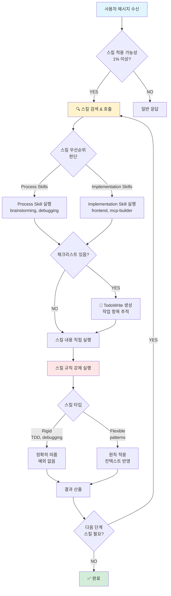
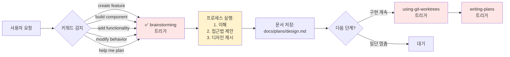
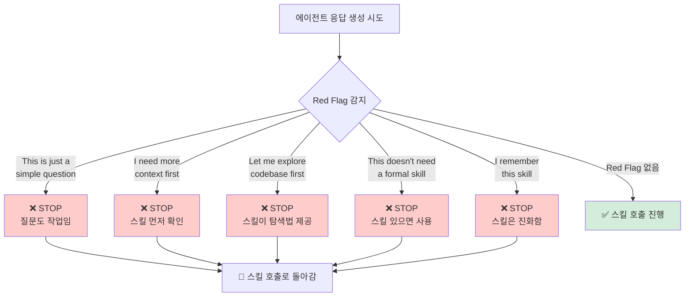

# Phase 1: 자동 트리거 워크플로우 - 개념 시각화

## 핵심 개념

Superpowers의 핵심은 **"상황 감지 → 스킬 자동 활성화 → 프로세스 강제 실행"** 흐름입니다.

---

## 전체 흐름 다이어그램



---

## 스킬 트리거 조건 (예시: brainstorming)



---

## Red Flags 감지 시스템 (합리화 방지)



---

## 스킬 체인 실행 (예: 전체 개발 워크플로우)

```mermaid
graph TD
    A[사용자: "Let's build X"] --> B[🔍 brainstorming<br/>트리거]
    
    B --> C[디자인 문서 생성:<br/>docs/plans/design.md]
    
    C --> D{사용자 승인?}
    
    D -->|YES| E[🔍 using-git-worktrees<br/>트리거]
    D -->|NO| B
    
    E --> F[격리된 브랜치 생성]
    
    F --> G[🔍 writing-plans<br/>트리거]
    
    G --> H[상세 계획 생성:<br/>docs/plans/plan.md]
    
    H --> I[🔍 subagent-driven-development<br/>또는 executing-plans<br/>트리거]
    
    I --> J[작업 단위별 실행]
    
    J --> K{각 작업마다:<br/>🔍 test-driven-development<br/>트리거}
    
    K --> L[RED → GREEN → REFACTOR]
    
    L --> M[🔍 requesting-code-review<br/>트리거]
    
    M --> N{리뷰 통과?}
    
    N -->|NO| O[수정]
    N -->|YES| P{더 작업?}
    
    O --> M
    
    P -->|YES| J
    P -->|NO| Q[🔍 finishing-a-development-branch<br/>트리거]
    
    Q --> R[✅ 완료:<br/>merge/PR/keep/discard]
    
    style B fill:#ffe6e6
    style E fill:#ffe6e6
    style G fill:#ffe6e6
    style I fill:#ffe6e6
    style K fill:#ffe6e6
    style M fill:#ffe6e6
    style Q fill:#ffe6e6
    style R fill:#d4edda
```

---

## 강제 실행 메커니즘 (Rigid Skills)

```mermaid
graph TB
    A[Rigid Skill 트리거<br/>예: TDD] --> B[철칙 제시:<br/>"NO CODE WITHOUT FAILING TEST"]
    
    B --> C{에이전트 응답}
    
    C -->|규칙 위반<br/>코드 먼저 작성| D[❌ 강제 삭제 지시]
    
    D --> E[처음부터 다시 시작]
    
    C -->|규칙 준수<br/>테스트 먼저 작성| F[✅ 진행 허용]
    
    F --> G[RED → watch fail]
    
    G --> H[GREEN → minimal code]
    
    H --> I[watch pass]
    
    I --> J[REFACTOR]
    
    J --> K{테스트 여전히<br/>통과?}
    
    K -->|NO| L[❌ 리팩토링 롤백]
    K -->|YES| M[✅ commit]
    
    L --> J
    M --> N{다음 기능?}
    
    N -->|YES| G
    N -->|NO| O[✅ 완료]
    
    style D fill:#ffcccc
    style L fill:#ffcccc
    style F fill:#d4edda
    style M fill:#d4edda
    style O fill:#d4edda
```

---

## 핵심 원칙 요약

### 1. **무조건 트리거 (1% Rule)**
- 1% 가능성이라도 있으면 스킬 호출
- "나중에" 또는 "필요 없을 것 같은데" 금지

### 2. **스킬 우선순위**
```
Process Skills (brainstorming, debugging)
          ↓
Implementation Skills (frontend, mcp-builder)
```

### 3. **Red Flags (합리화 방지)**
- "간단한 질문이니까" → 질문도 작업
- "컨텍스트 먼저 확인" → 스킬이 확인법 제공
- "스킬 기억나는데" → 스킬은 진화함

### 4. **Rigid vs Flexible**
- **Rigid**: 정확히 따름 (TDD, debugging)
- **Flexible**: 원칙 적용 (patterns)

### 5. **체크리스트 자동 생성**
- 스킬에 체크리스트 있으면 → TodoWrite 자동 생성
- 진행 상황 추적 가능

---

## openclaw 적용 시사점

### 1. **AGENTS.md 규칙 기반 자동 트리거**
- `AGENTS.md`에 "상황 → 스킬" 매핑 정의
- 예: Slack에 "에러" 키워드 → systematic-debugging 자동 실행

### 2. **Slack 메시지 패턴 감지**
```
Slack 메시지 수신 → 패턴 분석 → cron 트리거 → sub-agent 시작
```

### 3. **GitHub issue 라벨 기반**
```
Issue 라벨 "bug" → debugging skill 자동 할당
Issue 라벨 "feature" → brainstorming → plan → implement 체인
```

### 4. **Red Flags를 IDENTITY.md 규칙으로**
- "절대 금지" 섹션과 유사
- 위반 감지 → 자동 경고 → 재시도 강제
